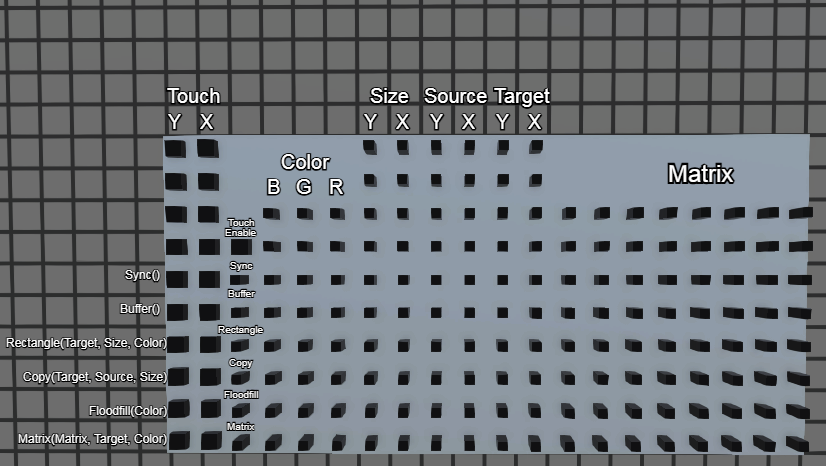

# Display mod for Logic World

* No limit on fps
* Supports matrix operations for fast text and low color image rendering
* Double buffering
* Touch screen

Supported operations:
* Matrix(Matrix, Target, Color) - provide matrix, color and target position - corresponding pixels will be set to provided color
* Floodfill(Color) - fill the screen with the color 
* Copy(Target, Source, Size) - copy a rectangular area of the screen to other position
* Rectangle(Target, Size, Color) - fill rectangular area with the color
* Buffer() - double buffering, if you don't need it, just enable it with other operations (the same tick)
* Sync() - pulse it to send the full picture to all clients, useful if a desynchronization occured

Touch enable pin activates when a player looks at the screen, `Touch` pins provide the position

Left and right mouse buttons can be detected with keys

## Pinout

